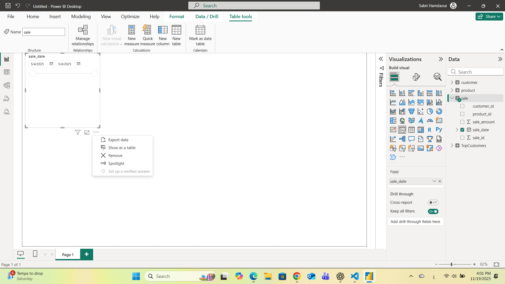
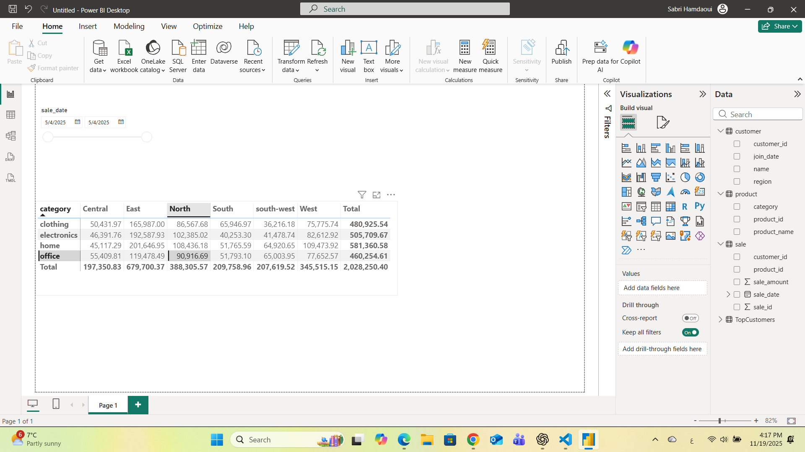
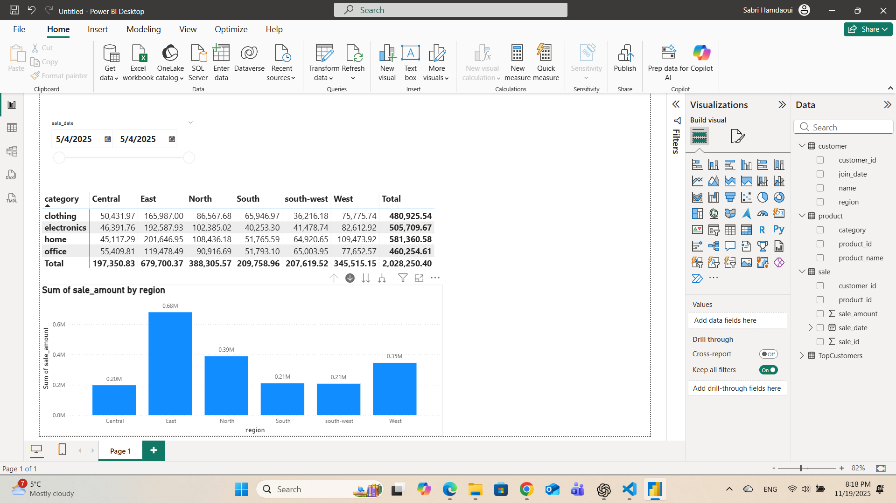
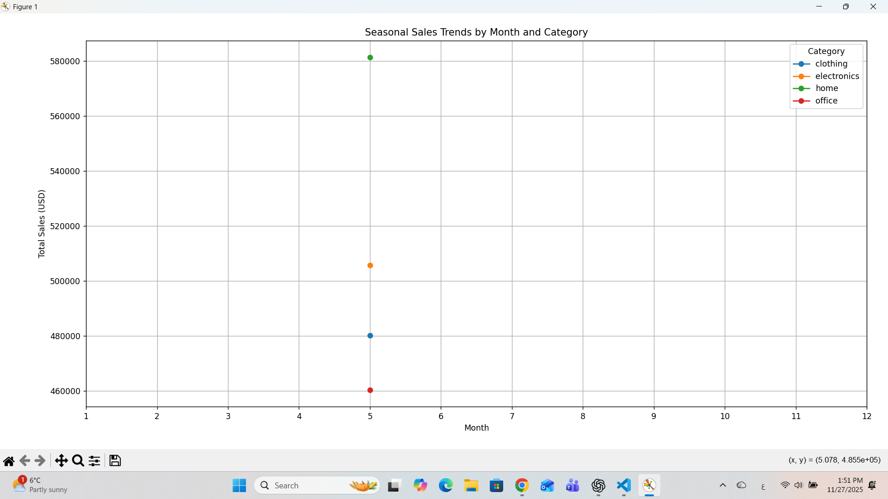
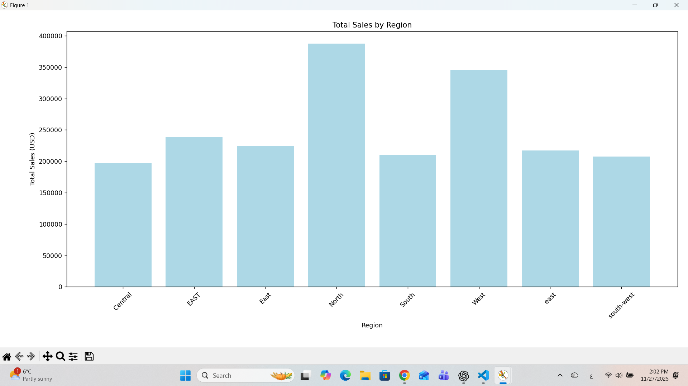

> Use this repo to start a professional Python BI project that reads raw data into pandas DataFrames.

- Course: Business Intelligence
- Instructor: Dr. Denise Case
- Repository Template: <https://github.com/denisecase/pro-analytics-02>
- Author: **Sabri Hamdaoui**, MBA – Data Analytics
- University: Northwest Missouri State University
- GitHub: [sabrouch36](https://github.com/sabrouch36)

---

# Smart Store Data Preparation (P3)

This project prepares raw business data (Customers, Products, and Sales) so it is clean, consistent, and ready for use in analytics and future ETL processes.

## Project Goal
The goal of this phase is to clean and standardize datasets to ensure accuracy and reliability when performing reporting, visualizations, or loading into a central data warehouse.

## Key Tasks Performed
- Removed duplicate records
- Handled missing values using simple fill strategies
- Standardized text fields (trim + lowercase)
- Automatically detected correct name columns
- Removed numeric outliers where appropriate
- Saved cleaned outputs into a `prepared/` data directory

## Files Processed
| Raw Dataset               | Output File                      |
|--------------------------|----------------------------------|
| `customers_data.csv`     | `customers_prepared.csv`         |
| `products_data.csv`      | `products_prepared.csv`          |
| `sales_data.csv`         | `sales_prepared.csv`             |

## Main Script
The primary pipeline is located at:
src/analytics_project/data_prep.py


## The reusable data cleaning helper class is located at:
src/utils/data_scrubber.py


## How to Run
From the project root:

uv sync
uv run python -m analytics_project.data_prep


## Output Location

Cleaned data is stored here:
/data/prepared/

## Logging

All execution logs are stored in:
project.log


Data is now clean and ready for the ETL and analysis steps in upcoming modules.
---

## 📘 P4 – Create and Populate Data Warehouse (DW)

### 🎯 Project Overview
In this phase, we designed and implemented a **data warehouse** using SQLite to support business intelligence and analytics.
The project follows the workflow: **Design → Build → Load → Verify → Document**.

### 🧱 Schema Design
The warehouse uses a **Star Schema** consisting of:
- **Fact Table:** `sale`
- **Dimension Tables:** `customer`, `product`

Each sale record references a customer and a product, enabling cross-analysis of performance and customer behavior.

**Entity Relationships**
- `sale.customer_id` → `customer.customer_id`
- `sale.product_id` → `product.product_id`

### ⚙️ Implementation
The ETL script [`etl_to_dw.py`](src/analytics_project/etl_to_dw.py):
- Creates the SQLite database `smart_sales.db` in `data/dw/`
- Defines tables using SQL `CREATE TABLE` statements
- Loads prepared CSV files from `data/prepared/`
- Removes duplicates, enforces primary and foreign keys
- Commits all data into the warehouse and validates relationships

### 📊 Verification
After running the script, we verified:
| Table | Row Count | Status |
|--------|------------|---------|
| customer | 200 | ✅ |
| product | 100 | ✅ |
| sale | 1999 | ✅ |

**Foreign Keys:** OK ✅
**Null / Duplicate Checks:** All Passed ✅

### 🧪 Example Query (Join)
```sql
SELECT s.sale_id, c.name, p.product_name, s.sale_amount, s.sale_date
FROM sale s
JOIN customer c USING (customer_id)
JOIN product  p USING (product_id)
LIMIT 10;

🧭 How to Run
python src/analytics_project/etl_to_dw.py
This will recreate the DW schema and reload all prepared data.
```
## 📸 Screenshots


📊 P5 – Cross-Platform Reporting with Power BI
🎯 Overview

In this phase, we used Power BI Desktop (Windows implementation) to connect to the SQLite data warehouse created in P4, perform OLAP operations, and generate interactive business intelligence reports.

The reporting workflow included:

Connecting Power BI to the SQLite warehouse via ODBC

Importing the customer, product, and sale tables

Cleaning the date column and converting it to a proper Date type

Creating slicers, pivot tables, and charts

Applying slice, dice, and drilldown operations

Producing final visualizations to analyze sales performance by category and region

🗂️ Data Model in Power BI

After loading the DW, the following model appeared in Power BI:

sale (fact table)

customer (dimension)

product (dimension)

Relationships were based on:

sale.customer_id → customer.customer_id

sale.product_id → product.product_id

✔ Relationships created successfully
✔ Date column cleaned and converted from text to Date
✔ Error row removed (2023-13-01)

🔍 OLAP Operations
1️⃣ Slice (Filter by Date)

Using a date slicer, sales were filtered using a specific date range:

Added a Slicer visual

Placed sale_date in the slicer

Set slicer type to Between

Result: shows sales only for the chosen time window
### 📌 Slice Operation (Date Filter)




2️⃣ Dice (Category × Region Pivot)

Created a matrix table to analyze sales by:

Rows: product category

Columns: customer region

Values: Sum of sale_amount

This produced a full cross-tab analysis (category × region), including totals.

📸 Matching screenshot:

### 🎲 Dice Operation (Category × Region)




3️⃣ Drilldown (Chart Visualization)

A clustered column chart was created:

X-axis: region

Legend: category

Y-axis: Sum of sale_amount

This enables:

Visual drilldown by clicking a category

Comparing regions

Seeing category patterns clearly

📸 Matching screenshot:



📈 Final Visuals Included

✔ Slicer for sale_date

✔ Pivot (matrix) for category × region

✔ Clustered column chart (drilldown enabled)

✔ Cleaned and validated data model

🛠️ Tools Used

Power BI Desktop (Windows)

ODBC connection to SQLite (smart_sales.db)

Star schema (fact_sale + dimensions)

📄 How to Reproduce

Launch Power BI Desktop

Get Data → ODBC → Select SQLite connection

Load the three DW tables

Convert sale_date column to Date

Create slicer, matrix, and chart

Save report as .pbix

Export screenshots for documentation

📸 Required Submission Images (all completed)


✔ Slice result (date filter)

✔ Dice result (category × region matrix)

✔ Drilldown chart (clustered columns)


📘 P6 – BI Insights and Storytelling (OLAP with Python)
🎯 Project Goal

The goal of this phase is to apply OLAP slicing, dicing, and drilldown techniques using Python to analyze seasonal sales trends and uncover actionable business insights.

Business Objective Selected:
Identify seasonal sales patterns across product categories and regions to improve inventory planning.

Short Name: Seasonal Sales Trends

This analysis helps the business prepare sufficient stock for high-demand periods, reduce overstock in slow months, and align staffing with sales peaks.

🗂️ Section 1 — Data Source

For this project, I used the data warehouse (smart_sales.db) created in P4.
The warehouse contains:

Table	Description
sale	Fact table of all transactions
customer	Customer dimension
product	Product dimension

Columns used:

From sale

sale_id

customer_id

product_id

sale_amount

sale_date

From customer

region

From product

category

These were combined into a single dataset using Python JOIN operations.

🧰 Section 2 — Tools Used

Python (Pandas, Matplotlib, Seaborn)

SQLite (warehouse)

Jupyter/VS Code terminal

uv package manager

Python was chosen because it supports:

automated OLAP-style analysis

fast grouping/aggregation

repeatable and scalable workflows

🔍 Section 3 — Workflow & OLAP Logic
✔ Step 1 — Load DW Tables

Loaded sale, customer, and product tables from the SQLite warehouse into Pandas DataFrames.

✔ Step 2 — Join Tables (DW → Analysis DataFrame)

Performed two JOIN operations:

sale × customer on customer_id

sale × product on product_id

Result: a fully enriched dataset with region + category info per transaction.

✔ Step 3 — Clean & Transform

Converted sale_date to proper datetime

Fixed invalid dates using errors="coerce"

Extracted:

year

month

Selected the useful OLAP fields

Final clean fields:

| year | month | category | region | sale_amount | sale_id |

🧮 Section 4 — Build OLAP Cube

Using groupby we generated a multi-dimensional cube:

Dimensions:

year

month

category

region

Metrics:

total_sales = SUM(sale_amount)

transactions = COUNT(sale_id)

AOV = total_sales / transactions

Example (first rows):

year	month	category	region	total_sales	AOV

Cube shape: (32, 7)

🪜 Section 5 — OLAP Operations

1️⃣ Slice (Filter a single dimension)
slice_2025 = cube[cube["year"] == 2025]
✔ Shows only sales for year 2025.

2️⃣ Dice (Filter multiple dimensions)
cube[(cube["category"] == "clothing") & (cube["region"].str.lower() == "north")]
✔ Clothing sales in the North region.

3️⃣ Drilldown (Year → Month)

Aggregated yearly totals:
Then drilled down to monthly totals:
yearly = cube.groupby("year").sum()
monthly = cube.groupby(["year", "month"]).sum()

✔ Shows high-level → detailed trend navigation.

📊 Section 6 — Visualizations
📈 1) Line Chart – Seasonal Trends by Category

Shows monthly sales patterns:


Interpretation:

Product categories show variation in seasonal demand.

Home and Electronics showed higher total sales in the provided dataset.

🔥 2) Heatmap (Month × Category)


Interpretation:

Month 5 showed highest activity across all categories.

Heatmap highlights which product categories spike during specific months.

📊 3) Bar Chart – Total Sales by Region



Interpretation:

North and West regions generated the highest revenue.

Useful for regional stocking and staffing decisions.

🧭 Section 7 — Business Insights

✔ The North and West regions consistently outperform others
✔ Electronics and Home categories generate the largest revenue
✔ Month 5 shows a strong seasonal spike
✔ AOV is highest in high-sales categories (e.g., Home)

🛠️ Section 8 — Recommended Business Actions

Based on the OLAP analysis:

📌 Inventory

Increase inventory for Home and Electronics categories before peak season.

Reduce overstock for lower-performing regions.

📌 Staffing

Add temporary staff in North + West regions during high-demand months.

📌 Marketing

Launch targeted promotions for categories with moderate performance.

📌 Regional Strategy

Investigate reasons behind lower sales in “south-west” and “east”.

⚠️ Section 9 — Challenges Encountered

Invalid dates (2023-13-01) required cleaning with errors="coerce"

Region names were inconsistent (east, EAST, East)

Visualizations required temporarily disabling multiple plt.show() calls to avoid Tk window blocking

Dataset only includes one month (May), so seasonal variation is limited

📎 How to Reproduce

From project root:

uv sync
uv run python -m analytics_project.olap_seasonal


Screenshots should be saved to:

docs/images/

🎉 P6 Complete

This phase provided a full OLAP-style analysis pipeline:

Warehouse → Clean → Join → Cube → OLAP → Visual Storytelling
Ready for real BI decision-making.
