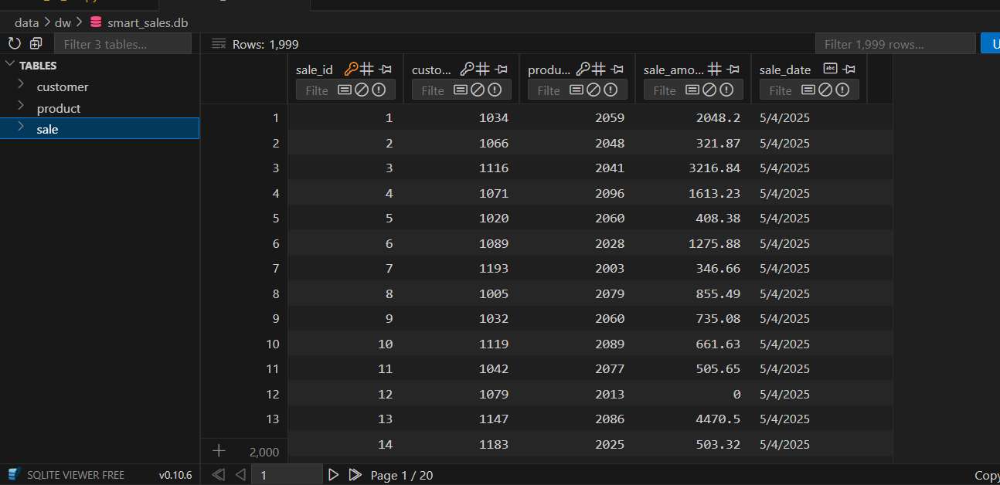
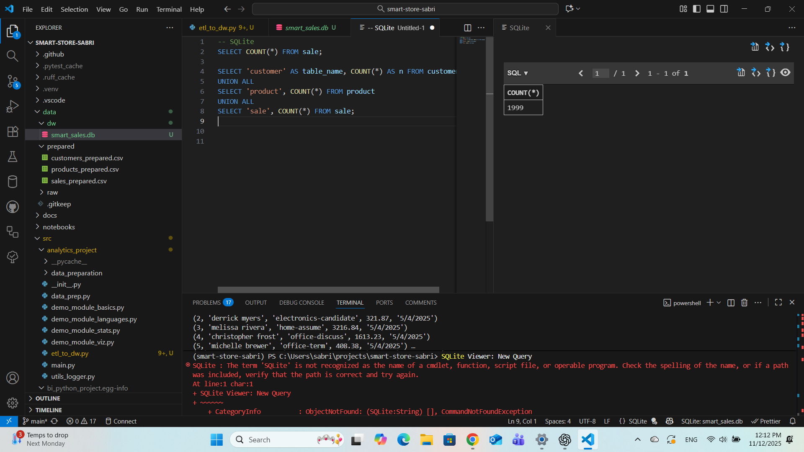
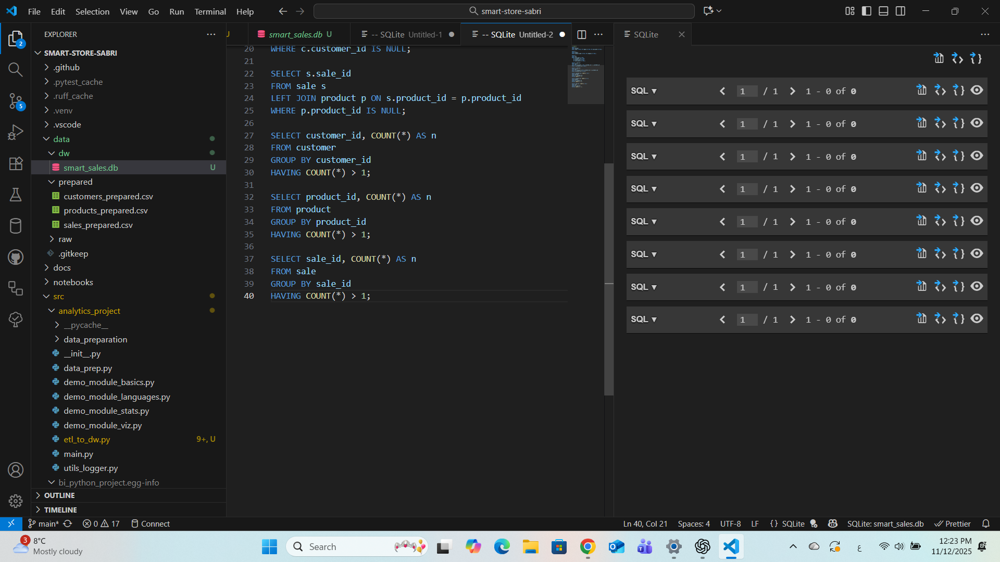

> Use this repo to start a professional Python BI project that reads raw data into pandas DataFrames.

- Course: Business Intelligence
- Instructor: Dr. Denise Case
- Repository Template: <https://github.com/denisecase/pro-analytics-02>
- Author: **Sabri Hamdaoui**, MBA – Data Analytics
- University: Northwest Missouri State University
- GitHub: [sabrouch36](https://github.com/sabrouch36)

---

# Smart Store Data Preparation (P3)

This project prepares raw business data (Customers, Products, and Sales) so it is clean, consistent, and ready for use in analytics and future ETL processes.

## Project Goal
The goal of this phase is to clean and standardize datasets to ensure accuracy and reliability when performing reporting, visualizations, or loading into a central data warehouse.

## Key Tasks Performed
- Removed duplicate records
- Handled missing values using simple fill strategies
- Standardized text fields (trim + lowercase)
- Automatically detected correct name columns
- Removed numeric outliers where appropriate
- Saved cleaned outputs into a `prepared/` data directory

## Files Processed
| Raw Dataset               | Output File                      |
|--------------------------|----------------------------------|
| `customers_data.csv`     | `customers_prepared.csv`         |
| `products_data.csv`      | `products_prepared.csv`          |
| `sales_data.csv`         | `sales_prepared.csv`             |

## Main Script
The primary pipeline is located at:
src/analytics_project/data_prep.py


## The reusable data cleaning helper class is located at:
src/utils/data_scrubber.py


## How to Run
From the project root:

uv sync
uv run python -m analytics_project.data_prep


## Output Location

Cleaned data is stored here:
/data/prepared/

## Logging

All execution logs are stored in:
project.log


Data is now clean and ready for the ETL and analysis steps in upcoming modules.
---

## 📘 P4 – Create and Populate Data Warehouse (DW)

### 🎯 Project Overview
In this phase, we designed and implemented a **data warehouse** using SQLite to support business intelligence and analytics.
The project follows the workflow: **Design → Build → Load → Verify → Document**.

### 🧱 Schema Design
The warehouse uses a **Star Schema** consisting of:
- **Fact Table:** `sale`
- **Dimension Tables:** `customer`, `product`

Each sale record references a customer and a product, enabling cross-analysis of performance and customer behavior.

**Entity Relationships**
- `sale.customer_id` → `customer.customer_id`
- `sale.product_id` → `product.product_id`

### ⚙️ Implementation
The ETL script [`etl_to_dw.py`](src/analytics_project/etl_to_dw.py):
- Creates the SQLite database `smart_sales.db` in `data/dw/`
- Defines tables using SQL `CREATE TABLE` statements
- Loads prepared CSV files from `data/prepared/`
- Removes duplicates, enforces primary and foreign keys
- Commits all data into the warehouse and validates relationships

### 📊 Verification
After running the script, we verified:
| Table | Row Count | Status |
|--------|------------|---------|
| customer | 200 | ✅ |
| product | 100 | ✅ |
| sale | 1999 | ✅ |

**Foreign Keys:** OK ✅
**Null / Duplicate Checks:** All Passed ✅

### 🧪 Example Query (Join)
```sql
SELECT s.sale_id, c.name, p.product_name, s.sale_amount, s.sale_date
FROM sale s
JOIN customer c USING (customer_id)
JOIN product  p USING (product_id)
LIMIT 10;

🧭 How to Run
python src/analytics_project/etl_to_dw.py
This will recreate the DW schema and reload all prepared data.
```
## 📸 Screenshots






